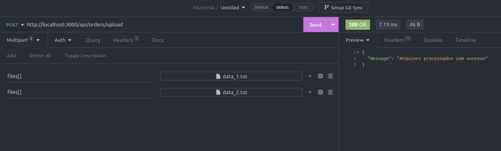
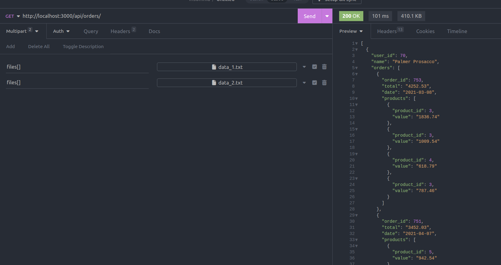
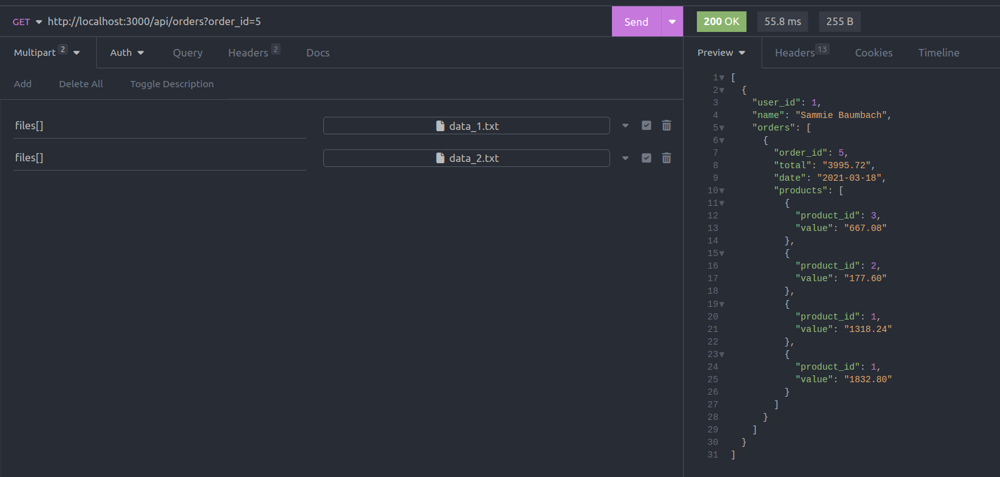
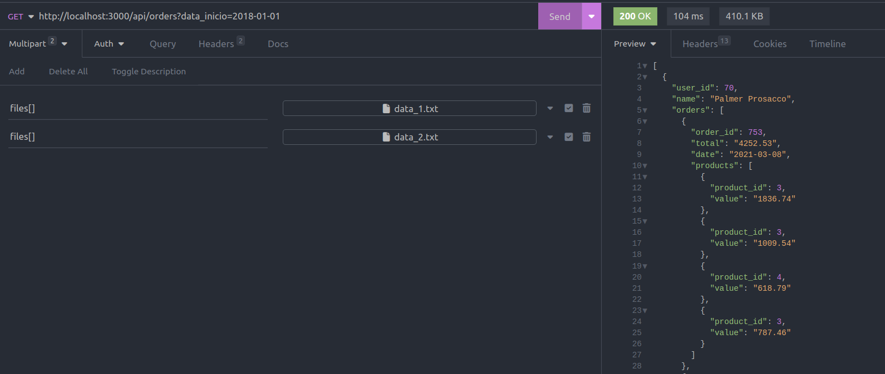
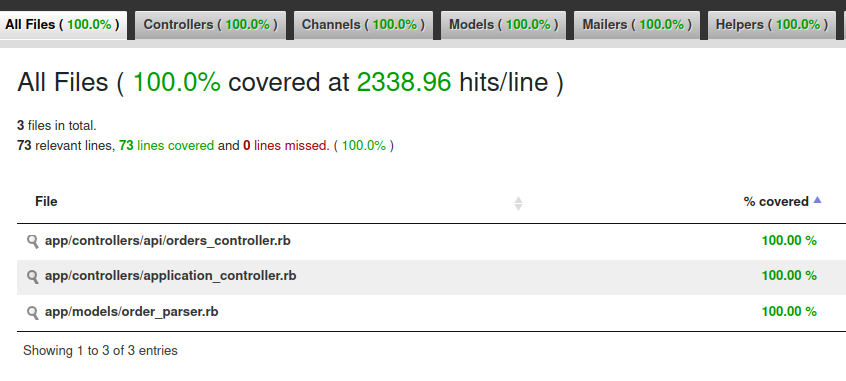

# Order Parser API

API em Ruby on Rails para processamento e normalização de dados de pedidos a partir de arquivos de texto.

---

## Sobre a aplicação

Esta API recebe um ou mais arquivos com dados de pedidos, realiza o parsing das linhas, filtra e normaliza as informações agrupando por usuário, pedidos e produtos.

Endpoints principais:
- `POST /api/orders/upload`: Recebe e salva os arquivos para processamento.

- `GET /api/orders`: Retorna os pedidos normalizados, com filtros opcionais por `order_id` e intervalo de datas.





---

## Tecnologias utilizadas

- Ruby on Rails
- Docker e Docker Compose
- Minitest (para testes)
- RuboCop (linter)
- SimpleCov (para cobertura de testes)

---

## Requisitos

- Docker
- Docker Compose

---

## Como rodar a aplicação com Docker

1. Clone o repositório:

   ```bash
   git clone <https://github.com/rayanerocha07/order-parser-api>
   cd order_parser_api
   ```

2. Faça o build da imagem do Docker:

   ```bash
   docker compose build
   ```

3. Rode a aplicação no container:

   ```bash
   docker compose up
   ```

A API estará disponível em [http://localhost:3000](http://localhost:3000).

---

## Comandos úteis dentro do container

Para executar comandos dentro do container, use:

```bash
docker compose run web bash
```

### Rodar os testes (incluindo verificação de cobertura com a gem simplecov)

```bash
bundle exec rails test
```



### Rodar o RuboCop (lint)

```bash
bundle exec rubocop
```


---

## Estrutura básica de endpoints

| Método | Endpoint             | Descrição                      |
|--------|----------------------|--------------------------------|
| POST   | `/api/orders/upload` | Faz upload do arquivo de pedidos |
| GET    | `/api/orders`        | Retorna dados normalizados e filtrados |

---

## Filtros disponíveis para GET /api/orders

- `order_id`: filtra pedidos pelo ID do pedido.
- `data_inicio` e `data_fim`: filtram pedidos entre as datas no formato `YYYY-MM-DD`.
